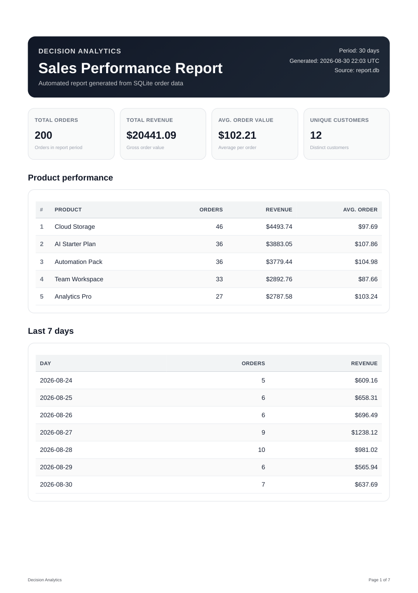

# FlyRank A8 — PDF Report Generator

A production-style backend reporting pipeline built for the FlyRank Backend Track Week 4 Assignment A8.

It turns SQLite order data into a polished multi-page PDF and serves the generated artifact through an API link.

## Pipeline

```text
SQLite
  ↓
SQL aggregation
  ↓
Report data object
  ↓
Jinja2 HTML template
  ↓
Playwright / Chromium
  ↓
PDF file on disk
  ↓
SQLite report metadata
  ↓
FastAPI download link
```

The project follows the artifact rule:

> Generate the file, store it, and return a link instead of passing PDF bytes through JSON.

---

## Stack

- Python
- FastAPI
- SQLite
- Jinja2
- Playwright
- Chromium
- SHA-256 artifact verification

---

## Dataset

The example dataset represents a small shop.

The `orders` table contains:

- `id`
- `customer`
- `product`
- `amount`
- `created_at`

The seed script generates exactly **200 orders** across six products.

It first removes existing orders, so running it repeatedly remains idempotent:

```bash
python scripts/seed.py
python scripts/seed.py
```

Both runs leave exactly:

```text
200 orders
```

`report.db` is generated locally and intentionally excluded from Git.

---

## Setup

Create and activate a virtual environment:

```bash
python -m venv .venv
source .venv/bin/activate
```

Install dependencies:

```bash
pip install -r requirements.txt
playwright install chromium
```

Seed the database:

```bash
python scripts/seed.py
```

Start the API:

```bash
uvicorn app.main:app --reload
```

The default API URL is:

```text
http://127.0.0.1:8000
```

If that port is already occupied, another port can be used:

```bash
uvicorn app.main:app --reload --port 8001
```

---

## Health Check

```bash
curl http://127.0.0.1:8000/health
```

Example:

```json
{
  "status": "ok",
  "service": "pdf-report-generator"
}
```

---

# SQL Aggregations

The report is built from four core aggregation requirements.

## 1. Total order count

```sql
SELECT COUNT(*) AS total_orders
FROM orders
WHERE created_at >= ?;
```

## 2. Total revenue

```sql
SELECT
    COALESCE(SUM(amount), 0) AS total_revenue,
    COALESCE(AVG(amount), 0) AS average_order_value,
    COUNT(DISTINCT customer) AS unique_customers
FROM orders
WHERE created_at >= ?;
```

## 3. Top five products by revenue

```sql
SELECT
    product,
    COUNT(*) AS order_count,
    ROUND(SUM(amount), 2) AS revenue,
    ROUND(AVG(amount), 2) AS average_order_value
FROM orders
WHERE created_at >= ?
GROUP BY product
ORDER BY revenue DESC
LIMIT 5;
```

## 4. Orders per day for the last seven days

```sql
SELECT
    DATE(created_at) AS day,
    COUNT(*) AS orders,
    ROUND(SUM(amount), 2) AS revenue
FROM orders
WHERE created_at >= ?
GROUP BY DATE(created_at)
ORDER BY day ASC;
```

Additional metrics include:

- average order value
- unique customer count
- top product by units
- complete order listing

---

# PDF Generation

The report HTML contains:

- branded report header
- total orders KPI
- total revenue KPI
- average order value KPI
- unique customers KPI
- top five products table
- last seven days table
- complete orders table
- repeated table headers
- safe page breaks
- page numbers

The PDF is rendered by headless Chromium using Playwright.

Important print behavior includes:

```css
thead {
    display: table-header-group;
}

tr {
    break-inside: avoid;
    page-break-inside: avoid;
}
```

The generated sample report is seven pages long.

## PDF Preview



---

# API

## Generate a report

```http
POST /reports
```

Optional query parameter:

```text
days=30
```

Example:

```bash
curl -i -X POST \
  "http://127.0.0.1:8000/reports?days=30"
```

A newly generated report returns:

```text
HTTP 201 Created
```

Example response:

```json
{
  "id": "53aea728-6ffa-4830-9197-4fc6b117fe6a",
  "status": "done",
  "days": 30,
  "filename": "sales-report-2026-08-30-53aea728.pdf",
  "file": "/reports/53aea728-6ffa-4830-9197-4fc6b117fe6a/file",
  "file_size_bytes": 62311,
  "sha256": "ebcf6b46861127b9eab19c7a91bf9b1308720e848eeb339b8020e72b27c11e90"
}
```

The synchronous request intentionally takes visible time because SQL aggregation, HTML rendering, Chromium startup, PDF rendering, and disk storage happen inside the request.

### When should this leave the request?

In production I would move PDF generation out of the HTTP request when reports become expensive, datasets become larger, multiple users generate reports concurrently, or generation time becomes long enough to risk request timeouts. A background worker would allow the API to return immediately and expose report status separately.

---

## Read report metadata

```http
GET /reports/{id}
```

Example:

```bash
curl \
  "http://127.0.0.1:8000/reports/REPORT_ID"
```

---

## Download the PDF

```http
GET /reports/{id}/file
```

Example:

```bash
curl \
  "http://127.0.0.1:8000/reports/REPORT_ID/file" \
  --output report.pdf
```

The API serves the stored artifact by link rather than embedding the PDF in the API response.

---

## Unknown reports

An unknown report ID returns:

```text
HTTP 404 Not Found
```

---

# Daily Idempotency

Normal report generation is protected against duplicate requests.

For the same day and report period:

```text
first POST  -> 201 Created
second POST -> 200 OK
```

Both requests return the same report ID and file link.

The protection prevents accidental double-clicks, retries, or repeated client requests from generating duplicate artifacts and duplicate database records.

Without idempotency in a real system, retries could waste compute, create duplicate files, send duplicate reports, consume storage, or trigger duplicate downstream operations.

The SQLite database also uses a unique idempotency key so the protection exists at the persistence layer rather than relying only on an application-level lookup.

---

## Force regeneration

Idempotency can be bypassed intentionally:

```bash
curl -X POST \
  "http://127.0.0.1:8000/reports?days=30&force=true"
```

This generates a new report and returns:

```text
HTTP 201 Created
```

---

# Verification

Stage 4 API verification:

```bash
python scripts/test_stage4.py
```

Stage 5 idempotency verification:

```bash
python scripts/test_stage5.py
```

When the API uses a different port:

```bash
BASE_URL=http://127.0.0.1:8001 \
python scripts/test_stage5.py
```

Verified behavior includes:

- health endpoint
- PDF generation
- HTTP 201 for new reports
- report metadata retrieval
- real PDF download
- HTTP 404 for unknown reports
- daily duplicate reuse
- `force=true`
- one idempotent database row
- SHA-256 file checksum

---

# Generated Files

Generated runtime artifacts are intentionally ignored:

```text
report.db
reports/*
```

The repository contains only source code and documentation artifacts.

---

# Project Structure

```text
.
├── app
│   ├── __init__.py
│   ├── db.py
│   ├── main.py
│   ├── pdf_renderer.py
│   ├── report_data.py
│   └── report_service.py
├── docs
│   └── report-page-1.png
├── reports
│   └── .gitkeep
├── scripts
│   ├── generate_test_pdf.py
│   ├── seed.py
│   ├── test_report_data.py
│   ├── test_stage4.py
│   └── test_stage5.py
├── templates
│   └── report.html
├── .gitignore
├── README.md
└── requirements.txt
```

---

# Current Features

- deterministic 200-row seed
- safe re-seeding
- SQL aggregation
- parameterized report period
- professional HTML report template
- multi-page A4 PDF
- clean row page breaks
- repeated table headers
- PDF page numbers
- nice report filenames
- report metadata persisted in SQLite
- downloadable artifact endpoint
- file size metadata
- SHA-256 verification
- daily idempotency
- forced regeneration
- configurable test API URL
- API verification scripts

---

# Next Extensions

The stretch implementation will add:

- asynchronous/background report generation
- report status tracking
- scheduled Monday reports
- email delivery through Mailpit
- report listing/control panel
- benchmark testing
- automated tests
- AI rematch comparison

---

# AI vs Me — Stage 7 Rematch

For the final assignment stage, the same PDF reporting feature was rebuilt independently with AI and compared against the hand-built implementation.

The original AI prompt is stored in:

```text
ai-version/PROMPT.md
```

The improved rematch prompt is stored in:

```text
ai-rematch/PROMPT.md
```

## What did the AI do better?

The first AI version improved dependency reproducibility by pinning exact versions and using conventional pytest/httpx automated testing.

The second AI rematch improved this further and passed four automated tests, while also documenting implementation decisions that were not explicitly specified.

## What did my implementation do better?

The hand-built version had much more complete assignment-oriented documentation from the beginning.

It documented:

- the full report pipeline
- the four required SQL aggregations
- API examples
- POST-to-download behavior
- synchronous generation tradeoffs
- idempotency behavior
- the real-world cost of missing idempotency
- the generated PDF screenshot
- artifact storage behavior

The first AI version's README was significantly shorter and omitted several of those assignment checkpoints.

## What did the AI get wrong or ignore?

The first AI version did not follow some details that were never made explicit in the original prompt.

For example, it chose a database named:

```text
shop.db
```

instead of:

```text
report.db
```

It also produced minimal documentation compared with the hand-built version.

Those were not necessarily implementation failures; they exposed ambiguity in the first prompt.

## What did I forget to specify?

The first prompt did not specify:

- the exact database filename
- exact dependency version pinning
- the required depth of README documentation
- the amount of automated test coverage
- that idempotency should be protected at the database layer
- how unspecified implementation decisions should be reported

The AI therefore made several of those decisions itself.

## Rematch

The second prompt explicitly added those missing constraints.

The rematch then produced:

- 4 passing tests
- 0 failed tests
- exactly 200 rows after repeated seeding
- successful Python compilation
- a real Chromium-generated A4 PDF
- a 6-page report
- database-level daily idempotency
- explicit `report.db` usage
- documented UTC behavior
- reproducible seeded data
- documented decisions that were not specified

This demonstrated a clear improvement from prompt version 1 to prompt version 2.

Detailed comparisons are available in:

```text
ai-version/COMPARISON.md
ai-rematch/COMPARISON.md
```

---

# Stretch — Scheduled Monday Report

A second Inngest function generates a report automatically every Monday at
08:00 using this cron expression:

```text
0 8 * * 1
```

The implementation uses Inngest's native `TriggerCron`, so a separate system
cron or Celery Beat process is not required.

The scheduled workflow uses durable steps:

```text
cron trigger
    ↓
create pending report
    ↓
mark processing
    ↓
query SQLite
    ↓
render and store PDF
    ↓
mark report done
```

The schedule currently uses UTC. Keeping the schedule and report timestamps in
UTC avoids daylight-saving-time ambiguity.

## What if the application server is down at 08:00?

The schedule itself is managed by Inngest rather than by an in-process Python
timer. In a deployed setup, Inngest can trigger the scheduled function
independently of the API request flow.

However, Inngest still needs the application's function-serving endpoint to be
reachable in order to execute the function. If the application is unavailable,
the run cannot complete at that moment and must rely on the workflow platform's
retry/recovery behavior after the application becomes reachable again.

For local development, both the FastAPI application and Inngest Dev Server must
be running.

---

# Stretch — Email Delivery with Mailpit

Completed reports can be delivered by email through a local Mailpit SMTP server.

The email contains a download link:

```text
http://127.0.0.1:8001/reports/{id}/file
```

The PDF itself is not attached.

## Local Mailpit

SMTP:

```text
127.0.0.1:1025
```

Mailpit web inbox:

```text
http://127.0.0.1:8025
```

The application supports these environment variables:

```text
SMTP_HOST
SMTP_PORT
REPORT_EMAIL_TO
REPORT_EMAIL_FROM
PUBLIC_BASE_URL
```

## Why send a link instead of attaching the PDF?

Links avoid email attachment size limits and reduce duplicate storage because the
same generated artifact does not need to be copied into every message.

A link also allows the server to keep one canonical report artifact and makes it
easier to add access control, expiration, auditing, or updated download behavior
later.

The Inngest workflow sends the email only after the PDF has been successfully
generated and the report has been marked as complete.

---

# Extra — 5,000 Row Benchmark

The reporting pipeline was benchmarked with a temporary dataset of 5,000 orders.

After the benchmark completed, the normal assignment dataset was automatically restored to exactly 200 rows.

## Results

```text
Rows: 5000
Seed: 0.037s
Aggregation: 0.0120s
PDF generation: 1.644s
Total measured: 1.693s
PDF size: 510.3 KB
```

## Observation

The SQL aggregation layer remained very fast even with 5,000 rows.

The largest part of the total runtime was PDF generation through Chromium, not the SQLite queries.

This supports moving report generation to a background worker for larger reports or higher-concurrency production workloads.

## Run the benchmark

```bash
python scripts/benchmark_5000.py
```

The script:

1. temporarily seeds 5,000 orders
2. measures seed time
3. measures SQL aggregation time
4. generates the full PDF
5. measures PDF generation time and artifact size
6. restores the original 200-row dataset

---

# Extra — CSV Companion Export

Every completed report can also be exported as CSV.

Endpoint:

```text
GET /reports/{id}/csv
```

The CSV contains:

```text
id
customer
product
amount
created_at
```

This provides a machine-readable companion artifact alongside the human-readable PDF.

Example:

```bash
curl \
  "http://127.0.0.1:8001/reports/REPORT_ID/csv" \
  --output report.csv
```

The CSV is generated from the same report dataset and stored under the ignored `reports/` runtime directory.
